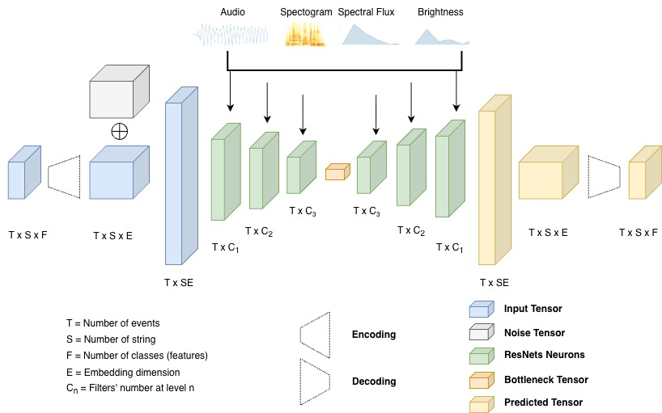

# Noise2Fret

This code repository is for the article _Playability-Aware Audio-To-Tablature Transcription Via Diffusion Models_

This repository contains all the necessary utilities to use our architecture. Find the code located inside the "./src" folder, and the weights of pre-trained models inside the "./weights" folder



### Folder Structure

```
./
├── src
└── weights
```

### Contents

1. [Datasets](#datasets)
2. [How to Train and Run Inference](#how-to-train-and-run-inference)

<br/>

# Datasets

Datasets are here: 
- [GuitarSet](https://zenodo.org/records/3371780)
- [GOAT](https://zenodo.org/records/17706552)

# How To Train and Run Inference 

First, install Python dependencies:
```
cd ./
pip install -r requirements.txt
```

To train models, use the ```starter.py``` script or via SSH with ```run.sh```.
Ensure you have loaded the dataset into the chosen datasets folder.

### Available Options

--data_dir - Root directory where the datasets are stored [str] (default="./data")

--model_path - Path to save or load the model checkpoint [str] (default="./models/model.pt")

--noise_steps - Number of diffusion noise steps [int] (default=1000)

--base_channels - Hidden dimension size (base number of channels) of the network [int] (default=64)

--embed_dim - Embedding dimension size [int] (default=32)

--feat - Feature type to use for conditioning [str] (default="all")

--batch_size - Number of samples per batch [int] (default=128)

--use_pre - When True, loads a pre-trained model before training [bool] (default=False)

--epochs - Number of training epochs [int] (default=60)

--lr - Initial learning rate [float] (default=3e-4)

--losses_str - Comma-separated list of loss functions to use [lst[str]] (default=[""])
 
-- train_model - When True, train the model before test [bool] (default=False)

Example training case: 
```
cd ./src
python starter.py \
  --data_dir ./data \
  --model_path ./models/my_model.pt \
  --noise_steps 1000 \
  --base_channels 64 \
  --embed_dim 32 \
  --feat alls \
  --batch_size 128 \
  --use_pre False \
  --epochs 60 \
  --lr 3e-4 \
  --losses_str [""]
  --train_model True
```

To only run inference on an existing pre-trained model, set the "train_model" flag to False. In this case, ensure you have the existing model and dataset (to use for inference) both in their respective directories with corresponding names.

Example inference case:
```
cd ./
python starter.py \
  --data_dir ./data \
  --model_path ./models/my_model.pt \
  --noise_steps 1000 \
  --base_channels 64 \
  --embed_dim 32 \
  --feat alls \
  --batch_size 128 \
  --use_pre False \
  --epochs 60 \
  --lr 3e-4 \
  --losses_str [""]
  --train_model False
```


# Bibtex

If you use the code included in this repository or any part of it, please acknowledge its authors by adding a reference to these publications:

```

```
