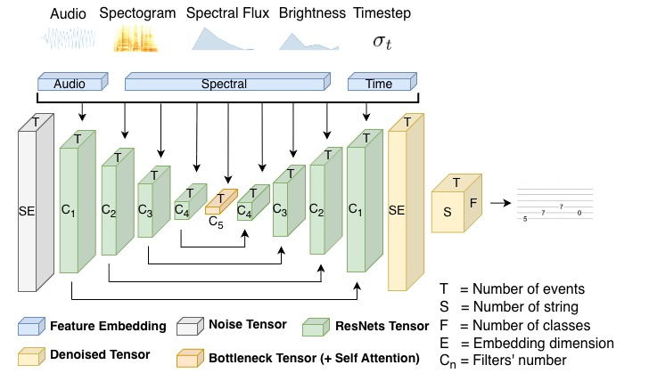

# Noise2Fret

This code repository is for the articles _Playability-Aware Audio-To-Tablature Guitar Transcription Via Diffusion Models_ (ISMIR26) in "./Noise2Fret_Aux_Losses" folder

and 

_Noise2Fret: Event-Based Audio-To-Tab Guitar Transcription_ (on review) in "./Noise2Fret_and_Onsets" folder

This repository contains all the necessary utilities to use our architectures.

<p align="center">

 <br/>
  <em>Figure 1: Overview of the proposed Noise2Fret architecture at inference time. Starting from a Gaussian noise tensor in the continuous embedding space (T x SE), the model iteratively denoises the representation through a 1D convolutional U-Net comprising four encoder stages, a self-attention bottleneck, and a symmetric decoder with skip connections. Audio, spectral features, and timestep are injected as conditioning signals at each resolution level. The final denoised embedding is projected back to per-string class logits over F fret states, yielding the predicted tablature tensor (T x S x F).</em>
   </p>

 
# Bibtex

If you use the code included in this repository or any part of it, please acknowledge its authors by adding a reference to these publications:

```
@inproceedings{simionato2026playability,
  title={Playability-Aware Audio-To-Tablature Guitar Transcription Via Diffusion Models},
  author={Simionato, Riccardo and Bigo, Louis},
  booktitle={Proceedings of the 27th International Society for Music Information Retrieval Conference},
  year={2026},
}
```
